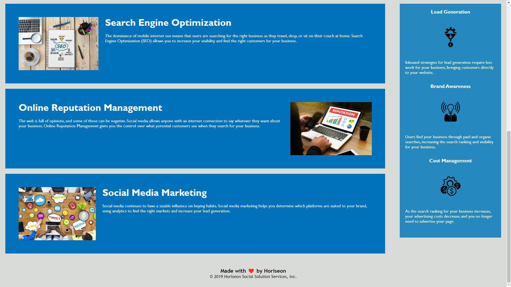

# Horiseon Code Refactor
> By Richard Zhang

## Description

- The motivation behind this project is to learn how to refactor source code. That is to improve the provided code without necessarily changing what it does. I also want to learn more about the tags used for html, and the properties used in CSS.
- Junior developers are commonly given code to refactor, and my goal is to eventually become a programmer, so this is a good way to learn. I built this project to become more comfortable with refactoring, the layout of html and CSS, to make the html more semantically correct, and the CSS more concise.
- The main goal of refactoring the provided source code is to make it more **accessible**.
- I hope to learn a bit about the general layout of webpages in this exercise, the connections between html, CSS, and JavaScript used (JS not included in this exercise), and of course how to properly refactor the provided code.
- My completed project should contain changes (with relevant comments) that make sense and accurately describe the content on the webpage in the html document. It should also consolidate the CSS to be more concise with changes that reflect the ones in the html document (with relevant comments detailing those changes).

## Screenshots and Link

> [Link to the live URL](https://richardzhang01.github.io/horiseon-code-refactor/)

